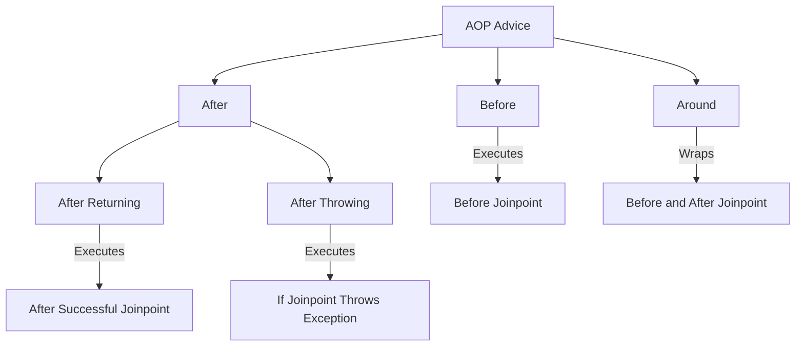

#!/bin/bash


# <span style="color: #2E86C1;">Aspect-Oriented Programming (AOP) README</span>

 overview of Aspect-Oriented Programming (AOP), its core concepts, and a comparison between AspectJ and Spring AOP. It includes detailed explanations of advice usage, joinpoint signatures, pointcut expressions, and a mind map of advices using Mermaid.

## <span style="color: #2874A6;">Table of Contents</span>
* [What is AOP?](#what-is-aop)
* [Aspect](#aspect)
* [Advice and Its Types](#advice-and-its-types)
    - [How to Use Advices](#how-to-use-advices)
* [Joinpoint](#joinpoint)
    - [Method Signature Using Joinpoint](#method-signature-using-joinpoint)
    - [Method Parameter Using Joinpoint](#method-parameter-using-joinpoint)
* [Pointcut](#pointcut)
    - [How to Write Pointcut Expressions](#how-to-write-pointcut-expressions)
    - [Match on Parameters Pointcut](#match-on-parameters-pointcut)
    - [Pointcut Declaration](#pointcut-declaration)
* [Target Object](#target-object)
* [Weaving](#weaving)
* [AspectJ vs. Spring AOP Differences](#aspectj-vs-spring-aop-differences)
* [Advices Mind Map](#advices-mind-map)
* [How to Order Advices](#how-to-order-advices)

## <span style="color: #2874A6;">1. What is AOP?</span>
Aspect-Oriented Programming (AOP) is a programming paradigm that enhances modularity by separating **_cross-cutting concerns_** (e.g., logging, security, transaction management) from core business logic. These concerns span multiple modules and can clutter code if not isolated. AOP encapsulates them into modular units called **_aspects_**, improving code reusability, maintainability, and scalability.

## <span style="color: #2874A6;">2. Aspect</span>
An **_aspect_** is a modular unit in AOP that encapsulates a cross-cutting concern. It combines:
* **_Advices_**: The logic to execute.
* **_Pointcuts_**: The locations in the code where the logic applies.

For example, an aspect for logging defines when (pointcut) and how (advice) logging occurs across multiple classes.

## <span style="color: #2874A6;">3. Advice and Its Types</span>
An **_advice_** is the code executed at specific points (**_joinpoints_**) to implement a cross-cutting concern. AOP defines five main advice types:
* **_Before Advice_**: Executes before the joinpoint (e.g., before a method runs).
* **_After Advice_**: Executes after the joinpoint, regardless of success or failure.
* **_After Returning Advice_**: Executes only if the joinpoint completes successfully.
* **_After Throwing Advice_**: Executes if the joinpoint throws an exception.
* **_Around Advice_**: Wraps the joinpoint, allowing logic before and after, and control over joinpoint execution.

### <span style="color: #5499C7;">How to Use Advices</span>
Advices are defined in an aspect class using annotations (in Spring AOP) or AspectJ syntax. Below are examples in Spring AOP:

- **_Before Advice_**:
```java
@Before("execution(* com.example.service.*.*(..))")
public void logBefore() {
    System.out.println("Logging before method execution");
}
```
$ **_Purpose_**: Executes before any method in the `com.example.service` package.

- **_After Advice_**:
```java
@After("execution(* com.example.service.*.*(..))")
public void logAfter() {
    System.out.println("Logging after method execution");
}
```
$ **_Purpose_**: Runs after the method, regardless of the outcome.

- **_After Returning Advice_**:
```java
@AfterReturning(pointcut = "execution(* com.example.service.*.*(..))", returning = "result")
public void logAfterReturning(Object result) {
    System.out.println("Method returned: " + result);
}
```
$ **_Purpose_**: Captures the return value of the method.

- **_After Throwing Advice_**:
```java
@AfterThrowing(pointcut = "execution(* com.example.service.*.*(..))", throwing = "exception")
public void logException(Exception exception) {
    System.out.println("Exception thrown: " + exception.getMessage());
}
```
$ **_Purpose_**: Executes when an exception is thrown.

- **_Around Advice_**:
```java
@Around("execution(* com.example.service.*.*(..))")
public Object logAround(ProceedingJoinPoint joinPoint) throws Throwable {
    System.out.println("Before method: " + joinPoint.getSignature());
    Object result = joinPoint.proceed(); // Execute the joinpoint
    System.out.println("After method with result: " + result);
    return result;
}
```
$ **_Purpose_**: Wraps the method, allowing pre- and post-processing, and control over method execution.

## <span style="color: #2874A6;">4. Joinpoint</span>
A **_joinpoint_** is a specific point in the program where an aspect’s advice can be applied, such as:
* **_Method execution_**
* **_Exception handling_**
* **_Object instantiation_**

In Spring AOP, joinpoints are typically method executions.

### <span style="color: #5499C7;">Method Signature Using Joinpoint</span>
The method signature can be accessed in an advice using the `JoinPoint` interface (or `ProceedingJoinPoint` for Around advice). Example:
```java
@Before("execution(* com.example.service.*.*(..))")
public void logMethodSignature(JoinPoint joinPoint) {
    String methodName = joinPoint.getSignature().getName();
    System.out.println("Executing method: " + methodName);
}
```
- **_Purpose_**: Retrieves the method name (e.g., `saveUser`) from the joinpoint.

### <span style="color: #5499C7;">Method Parameter Using Joinpoint</span>
Method parameters can be accessed via the `JoinPoint` interface:
```java
@Before("execution(* com.example.service.*.*(..))")
public void logMethodParameters(JoinPoint joinPoint) {
    Object[] args = joinPoint.getArgs();
    System.out.println("Method arguments: " + Arrays.toString(args));
}
```
- **_Purpose_**: Logs all arguments passed to the method.

## <span style="color: #2874A6;">5. Pointcut</span>
A **_pointcut_** is an expression that selects a set of joinpoints where an advice should be applied. It acts as a filter to target specific methods or points in the code.

### <span style="color: #5499C7;">How to Write Pointcut Expressions</span>
Pointcut expressions use AspectJ syntax, even in Spring AOP. The general format is:
```
execution(modifiers-pattern? return-type-pattern declaring-type-pattern? method-name-pattern(param-pattern))
```
Example:
```java
execution(public * com.example.service.*.*(String, ..))
```
- **_Modifiers_**: `public` (matches public methods).
- **_Return type_**: `*` (any return type).
- **_Declaring type_**: `com.example.service.*` (any class in the package).
- **_Method name_**: `.*` (any method name).
- **_Parameters_**: `(String, ..)` (methods with a String as the first parameter and any other parameters).

### <span style="color: #5499C7;">Match on Parameters Pointcut</span>
To match methods based on specific parameter types:
```java
@Pointcut("execution(* com.example.service.*.*(String, int))")
public void stringAndIntMethods() {}
```
- **_Purpose_**: Matches methods with exactly two parameters: a `String` and an `int`.

### <span style="color: #5499C7;">Pointcut Declaration</span>
Pointcuts are declared using the `@Pointcut` annotation in Spring AOP or AspectJ syntax. Example:
```java
@Pointcut("execution(* com.example.service.*.*(..))")
public void serviceMethods() {}
```
This pointcut can be reused in multiple advices:
```java
@Before("serviceMethods()")
public void logBefore() {
    System.out.println("Logging before service methods");
}
```
- **_Purpose_**: Defines reusable pointcuts to simplify advice application.

## <span style="color: #2874A6;">6. Target Object</span>
The **_target object_** is the object whose methods are intercepted by an aspect’s advice. In Spring AOP:
* **_Typical use_**: A Spring bean.
* **_Mechanism_**: A proxy is created around the target object to apply the aspect logic.

## <span style="color: #2874A6;">7. Weaving</span>
**_Weaving_** is the process of integrating aspects with the application code by linking advices to joinpoints. It can occur at:
* **_Compile-time_**: Aspects are woven into bytecode during compilation (AspectJ).
* **_Load-time_**: Aspects are woven when classes are loaded into the JVM.
* **_Runtime_**: Aspects are applied dynamically using proxies (Spring AOP).

## <span style="color: #2874A6;">8. AspectJ vs. Spring AOP Differences</span>
| **_Feature_**          | **_AspectJ_**                              | **_Spring AOP_**                          |
|-----------------------|-------------------------------------------|------------------------------------------|
| **_Scope_**           | Supports all joinpoints (e.g., method execution, field access). | Limited to method-level joinpoints for Spring beans. |
| **_Weaving_**         | Compile-time, load-time, or runtime weaving. | Runtime weaving via proxies (JDK or CGLIB). |
| **_Performance_**     | Faster due to compile-time/load-time weaving. | Slower due to runtime proxy overhead. |
| **_Ease of Use_**     | More complex, requires AspectJ tools.       | Simpler, integrated with Spring.         |
| **_Pointcut Language_** | Full AspectJ expressions.                 | Subset of AspectJ expressions.           |
| **_Dependency_**      | Requires AspectJ libraries.                | Built into Spring framework.             |

## <span style="color: #2874A6;">9. Advices Mind Map</span>
Below is a Mermaid diagram illustrating the types of advices in AOP:



## <span style="color: #2874A6;">10. How to Order Advices</span>
When multiple advices apply to the same joinpoint, their execution order must be defined to avoid conflicts. In Spring AOP:
* **_Use `@Order` annotation_**: Apply to the aspect class or implement the `Ordered` interface.
* **_Priority_**: Lower order values indicate higher priority (e.g., `@Order(1)` executes before `@Order(2)`).
* **_Around advice_**: Order determines the nesting of execution.

Example:
```java
@Aspect
@Order(1)
@Component
public class LoggingAspect {
    @Before("execution(* com.example.service.*.*(..))")
    public void logBefore() {
        System.out.println("Logging before method");
    }
}

@Aspect
@Order(2)
@Component
public class SecurityAspect {
    @Before("execution(* com.example.service.*.*(..))")
    public void checkSecurity() {
        System.out.println("Checking security");
    }
}
```
- **_Outcome_**: `LoggingAspect` executes before `SecurityAspect` due to its lower order value.

EOF

